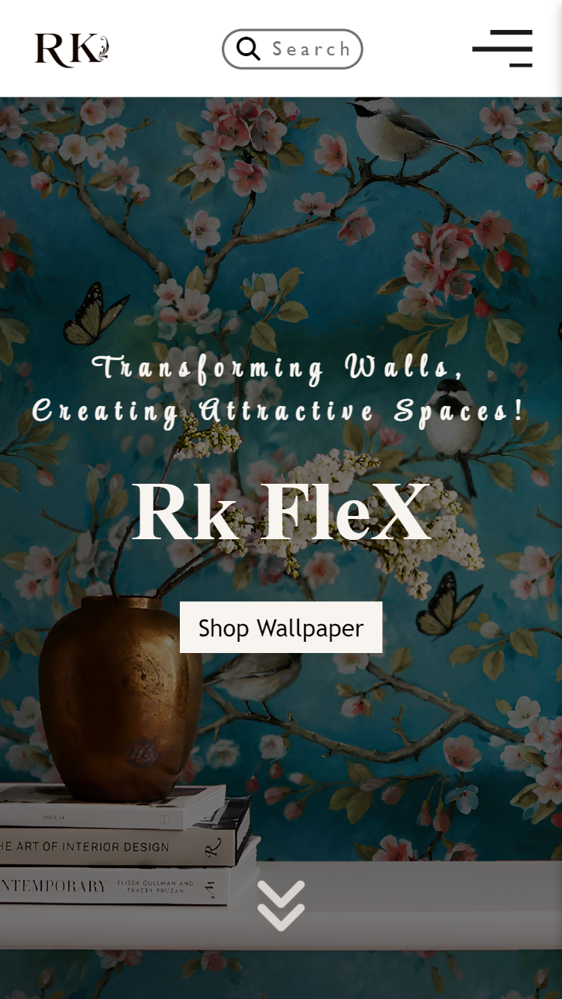

## 🚀 About the Project

RK FLEX is a clean, modern, and fully responsive business website designed for a flex-printing service.
It aims to present business information clearly and professionally to visitors on all devices.

This project was built to improve frontend skills and demonstrate real-world website structure.

--------------------------------------------------

## 📸 Screenshots

### Desktop View

  

### Mobile View

  

--------------------------------------------------

## 🚀 Getting Started

Follow the steps below to set up and run the project locally on your machine.

1️⃣ Clone the repository
git clone https://github.com/AbhiShekSehjal/RK-FLEX-Freelance-Work-.git

2️⃣ Navigate to the project directory
cd RK-FLEX-Freelance-Work-

3️⃣ Install dependencies
npm install

4️⃣ Start the development server
npm start

Once the server starts, the application will be available at:
👉 http://localhost:3000/

--------------------------------------------------

## 🛠 Tech Stack

React – UI Library

HTML5

CSS3

JavaScript (ES6+)

--------------------------------------------------

## 🔍 Features

✅ Fully responsive layout (mobile, tablet, desktop)
✅ Smooth user interface & navigation
✅ Simple and professional design
✅ Easy to customize for other business use cases

--------------------------------------------------

## 📁 Project Structure

RK-FLEX-Freelance-Work/
├── public/
│   └── index.html
├── src/
│   ├── assets/
│   ├── components/
│   ├── pages/
│   ├── App.js
│   └── index.js
├── .gitignore
├── package.json
└── README.md

--------------------------------------------------

## 📌 Why I Built This

I created this project to:

Sharpen my frontend skills using React

Practice responsive design

Build a real business-style landing page for my portfolio

--------------------------------------------------

## 📣 Feedback & Contributions

Your feedback means a lot!
Feel free to open issues or send suggestions ⭐

--------------------------------------------------

## 🙌 Connect with Me

👍 LinkedIn: https://www.linkedin.com/in/abhishek-sehjal-4a78a5353/

📧 Email: shek54112@gmail.com
